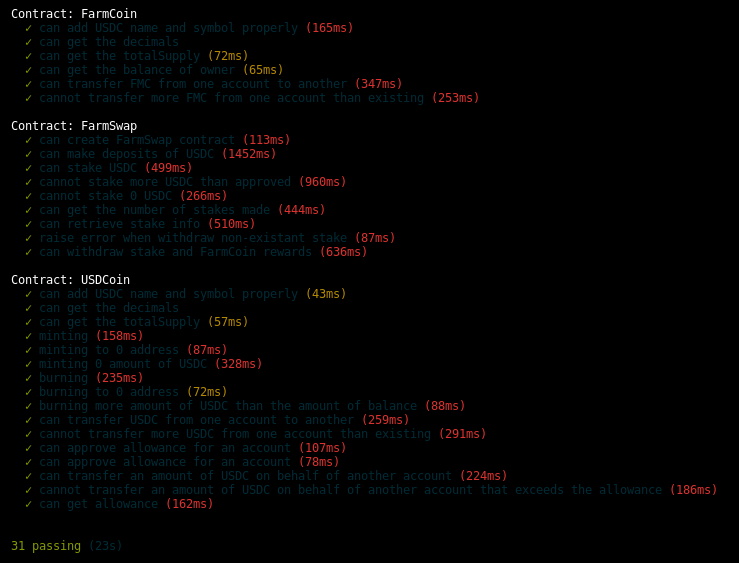

# FarmSwap

##### Table of Contents  
- [Introduction](#introduction)
- [System Design](#system-design)
- [Testing](#testing)
- [Built With](#built-with)

## Introduction
The FarmSwap projects consinsts of smart contracts in Solidity offering the following functionality:

- A contract that accepts USDC deposits and rewards the user with FarmCoins.
- If there is no lock up period, the user earns 10% APY in FarmCoin.
- For a six month lock up, the user earns 20% APY in FarmCoin.
- For a 1 year lock up, the user earns 30% APY in FarmCoin.
- In case of lock up, early withdraw incurs a 10% penalty fee to the original amount.

The contracts are written using the **Solidity compiler 0.8.7 version**. In this project the Truffle Suite is utilized in order to run a local blockchain and deploy the smart contracts on top of it. You have to change the pragma version which is used in **Ownable.sol** and **ERC20.sol** to: `pragma solidity 0.8.7;` 

## System Design
The functionality offered by the FarmSwap project is implemented by 4 smart contracts:

- **USDCoin.sol**: This contract is used in the context of this project in order to create an ERC-20 token which mocks USDC tokens.
- **Staking.sol**: This contract contains all the necessary functions that enable staking of USDC, calculating the amount of rewards and the penalty in case of early leave before the lock up period completes.
- **FarmSwap.sol**: This contract operates as a controller. It inherits the staking capabilities from the **Staking.sol** and holds the ownership of all FarmCoins created in order to reward the users who stake USDC. This contract also manages USDC deposits and withdraws between a user and its contract address. 
- **FarmCoin.sol**: This contract is used for the creation of an ERC-20 token called FarmCoin which is used to reward users.

## Testing

To test the FarmSwap follow the instructions below.

Download the repo, and follow the steps below in order to test it:

1. Install dependencies:

``npm install``

2. Open the truffle interactive console that also spawns a development blockchain:

`truffle develop`

3. Then inside the truffle console compile the smart contracts:

`compile`

4. Migrate the smart contracts:

`migrate`

5. Test the smart contracts:

`test`

### Testing the Smart Contracts
The result of the tests should look like the following:

## Built With

* [Solidity](https://solidity.readthedocs.io/en/v0.5.3/) - Solidity is an object-oriented, high-level language for implementing smart contracts.
* [Truffle Framework](http://truffleframework.com/) - Truffle is the most popular development framework for Ethereum with a mission to make your life a whole lot easier.
* [Ganache Local Blockchain](http://truffleframework.com/ganache/)
* [Remix Solidity IDE](https://remix.ethereum.org/)